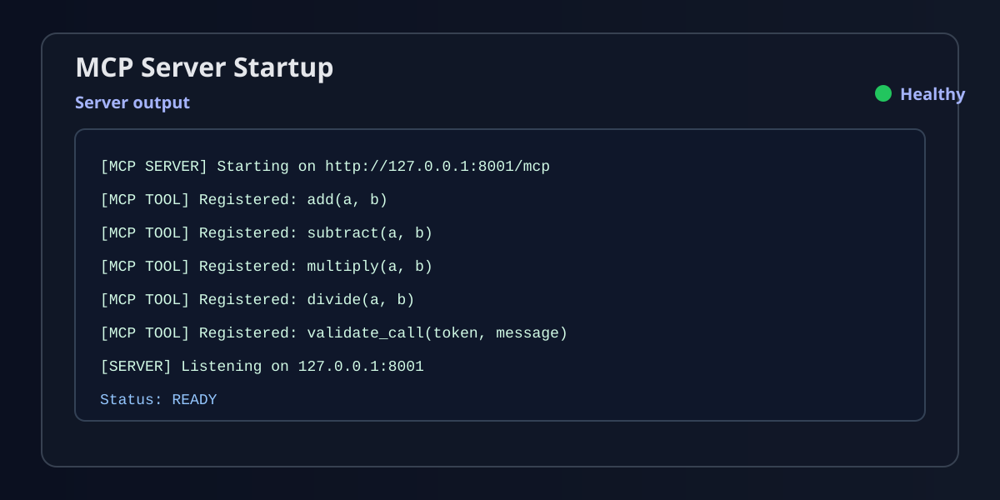
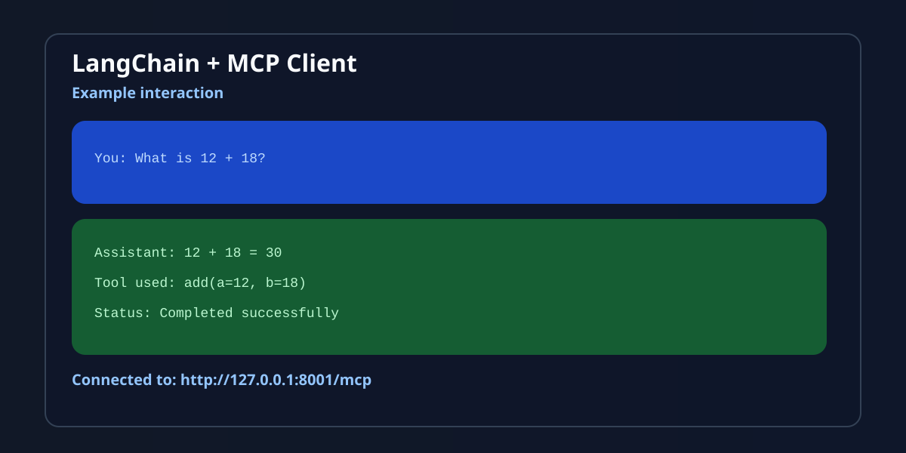

# My MCP Project

A simple Model Context Protocol (MCP) proof-of-concept that exposes calculator tools through an MCP server and connects to them from a LangChain-powered client using Groq.

## Quick Start

```bash
git clone <your-repo-url>
cd my-mcp-project
python -m venv .venv
.venv\Scripts\activate
pip install -e .
```

Create a `.env` file:

```env
GROQ_API_KEY=your_groq_api_key_here
GROQ_MODEL=llama-3.1-8b-instant
```

Start the server:

```bash
python server.py
```

In a second terminal, run the client:

```bash
python client.py
```

Then ask questions like:

```text
You: What is 12 + 18?
Assistant: 30
```

---

This project demonstrates how to:

- Start an MCP server with tools such as add, subtract, multiply, and divide
- Expose those tools over HTTP using `streamable-http`
- Connect a client to the MCP server
- Use a Groq LLM to call MCP tools dynamically from natural-language prompts

---

## Project Structure

- `server.py` – MCP server that exposes calculator tools
- `client.py` – client that connects to the server and uses a Groq model
- `pyproject.toml` – project metadata and Python dependencies
- `.env` – local environment file for your Groq API key

---

## Requirements

Before you run the project, make sure you have:

- Python 3.13 or newer
- A Groq account and API key
- Git installed

---

## Clone the Repository

```bash
git clone <your-repo-url>
cd my-mcp-project
```

---

## Set Up a Virtual Environment

From the project root:

```bash
python -m venv .venv
```

On Windows:

```bash
.venv\Scripts\activate
```

On macOS/Linux:

```bash
source .venv/bin/activate
```

---

## Install Dependencies

This project uses `pyproject.toml`, so install the package and dependencies like this:

```bash
pip install -e .
```

If you want to verify the installation afterwards:

```bash
python -c "import mcp, langchain_groq; print('Dependencies ready')"
```

---

## Configure Environment Variables

Create a `.env` file in the root folder with the following values:

```env
GROQ_API_KEY=your_groq_api_key_here
GROQ_MODEL=llama-3.1-8b-instant
```

Notes:

- `GROQ_API_KEY` is required for the client to work.
- `GROQ_MODEL` is optional; if omitted, the app falls back to `llama-3.1-8b-instant`.

---

## Run the MCP Server

Open a terminal in the project folder and run:

```bash
python server.py
```

You should see output similar to:

```text
[MCP SERVER] Starting on http://127.0.0.1:8001/mcp
```

This starts the MCP server and exposes the tools on:

```text
http://127.0.0.1:8001/mcp
```

---

## Run the Client

Open a second terminal, activate the virtual environment if needed, and run:

```bash
python client.py
```

The client will:

- read the Groq key from `.env`
- connect to the MCP server
- list available tools
- start an interactive chat session

Example interaction:

```text
You: What is 12 + 18?
Assistant: 30
```

You can also ask things like:

- "Multiply 7 by 9"
- "Divide 20 by 4"
- "Subtract 50 from 120"

Type `exit` to quit the client.

---

## Example Tools Exposed by the Server

The server exposes these tools:

- `add(a, b)`
- `subtract(a, b)`
- `multiply(a, b)`
- `divide(a, b)`
- `validate_call(token, message)`

---

## Troubleshooting

### 1. `GROQ_API_KEY is missing`

Make sure your `.env` file exists and contains the correct key.

### 2. Server does not start

Check whether port `8001` is free and whether you are running the server from the project root.

### 3. Client cannot connect to the server

Ensure the MCP server is already running before starting the client.

### 4. Module not found errors

Reinstall dependencies:

```bash
pip install -e .
```

---

## Notes

This project is a simple MCP proof-of-concept intended for learning and experimentation. It is useful for understanding how to:

- build tool-calling MCP servers
- connect a client to an MCP endpoint
- integrate MCP tools with LangChain and Groq

---

## Screenshots

These sample images show the expected project behavior:

### Server startup



### Client interaction



---

## License

This project is licensed under the [MIT License](LICENSE).

## Contributing

Contributions are welcome. Please see [CONTRIBUTING.md](CONTRIBUTING.md) for development and pull request guidelines.
